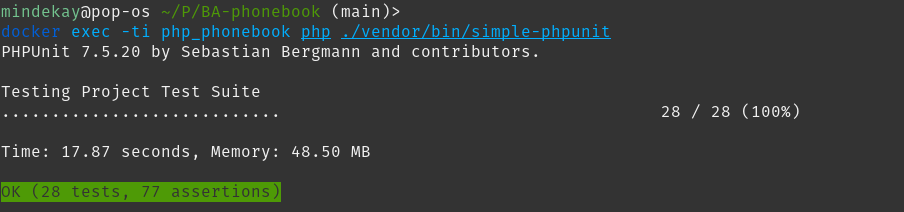

# BA-phonebook

---

## Description
This repository contains the code used to fulfill the requirements of the PHP application task for Baltic Amadeus. Below is the goal of the task and the list of the aforementioned requirements.

### Goal
Create a phone book web application

### Requirements

- phone book entries must be accessible by the registered user (personal entries)
- users should be able to share their personal phone book entry with others (and undo sharing)
- fields of the phone book entry: name, phone number, full CRUD
- at least one unit test
- at least one feature test
- application should use docker
- application should be accessed by either GUI or just API
- any extra features and ideas are a big plus

### Extra ideas implemented on the web application

- Friend requests system: users can send and receive friend requests, accept/decline them, view the lists of sent/received pending requests.
 Users can also view a list of available invitation options based on current friends and pending requests.
- Friend suggestion system: users can get invitation options suggestions based on the number of mutual friends between the user and the user represented by the invitation option.

---
## Installation instructions

1. Clone repository ```$ git clone https://github.com/gitguuddd/BA-phonebook.git``` or ```$ git clone git@github.com:gitguuddd/BA-phonebook.git``` if you're using SSH
2. ```cd``` to ```BA-phonebook``` folder
3. Ensure that both ports ```3307``` (used for Mysql) and ```81``` (used for nginx) aren't in use on your system
4. Run ```./init.sh```, when asked for pem passphrase use the ```JWT_PASSPHRASE``` provided in env files ```.env``` and ```.env.test```. Default passphrase: ```bf1c7cb4ffe10b1b82db464c3cfc206a```
5.  **Optional:** load the fixture data onto the main database ```docker exec -ti php_phonebook php bin/console doctrine:fixtures:load```.
 By loading the data onto the main database you'll be able to use all API endpoints in the postman collection with just minor adjustments.

**Important note:** make sure the fixture data is loaded only once for each database (test env is already loaded during init.sh)- the tests and API collection contain hardcoded entry ids. After loading the fixture data a second time these ids would become invalid.

---
## Testing

The application contains:
- ```two``` functional tests:
    - smoke test which tests the availability of most of the endpoints
    - authorization test which tests the registration and login process of a new user
- ```26``` unit tests which cover most of the cases of each API endpoint
- ```none``` of true feature tests, because without a GUI there's nowhere to use DOM crawler, etc.

### Running the tests

The tests can be run with the use of this command: ```docker exec -ti php_phonebook php ./vendor/bin/simple-phpunit```.
 If everything is OK the terminal should output something similar to this:



---

## Using the application

 The web application contains ```16``` API endpoints. Due to the nature of the application (pure API), API testing platforms such as Postman should be used to interact with the application.
 All API routes, except register and login,  are **authorized** by a ```JWT``` token - the token received after logging in should be parsed into the authorization tab **Bearer token** type field. Below is the link to the published, Postman compatible, application endpoints` documentation. Below is also the link to a json file, which can be used to import application API endpoints collection into the Postman tool.

[Application endpoints documentation](https://documenter.getpostman.com/view/5871347/TVewYPtu)

[Postman export file](https://www.dropbox.com/s/mpud0lluo59j7wj/BA-phonebook%20API.postman_collection.json?dl=0)

---

## Choosing between docker and local environment

Due to issues with ```.dockerignore``` file, docker is unable to ignore ```.env``` files. Because of this problem only one environment should be used at a time. 
If you use ```.env.local``` or ```.env.test.local``` for the local configuration - delete these files before running docker, otherwise the docker configuration containing default ```.env``` and ```.env.test``` files will be overwritten and the php container won't be able to communicate with the Mysql container.

---


## Changelog

### [v1.1.1](https://github.com/gitguuddd/BA-phonebook/releases/tag/v1.1.1) - (2020-11-24)

**Changed**
- README.md
- init.sh

### [v1.1](https://github.com/gitguuddd/BA-phonebook/releases/tag/v1.1) - (2020-11-24)

**Added**
- init.sh

**Changed**
- README.md

### [v1.0](https://github.com/gitguuddd/BA-phonebook/releases/tag/v1.0) - (2020-11-23)

**Added**
- README.md
- Core functionality + extra features
- Tests
- Docker configuration files (```docker-compose.yml```), etc.
- Database migration

**Known issues/where to improve**
- Phonebook entry ```first_name``` and ```last_name``` validation regex expression fails to prevent invalid format names
- ```AuthorizedClientFetcher``` uses a hacky ```self::ensureKernelShutdown();``` solution to enable the use of multiple clients.
- ```findFriendPhonebookEntries()``` found in ```PhonebookEntryRepository``` utilizes a hacky,
 scalar result manipulation based solution to output phone book entries in the correct format.
 
**Ideas for future versions**
- Block user feature (prevent sending requests)
- Friend requests mailables (request received, request accepted)
